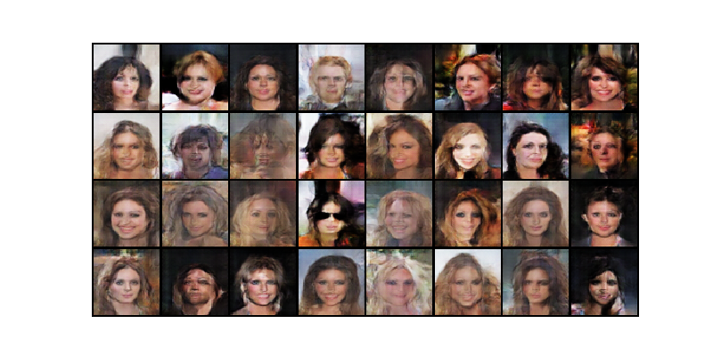

# DCGAN

### Title
[Unsupervised Representation Learning with Deep Convolutional Generative Adversarial Networks](https://arxiv.org/abs/1511.06434)

### Abstract
In recent years, supervised learning with convolutional networks (CNNs) has seen huge adoption in computer vision applications. Comparatively, unsupervised learning with CNNs has received less attention. In this work we hope to help bridge the gap between the success of CNNs for supervised learning and unsupervised learning. We introduce a class of CNNs called deep convolutional generative adversarial networks (DCGANs), that have certain architectural constraints, and demonstrate that they are a strong candidate for unsupervised learning. Training on various image datasets, we show convincing evidence that our deep convolutional adversarial pair learns a hierarchy of representations from object parts to scenes in both the generator and discriminator. Additionally, we use the learned features for novel tasks - demonstrating their applicability as general image representations.
        
## Train
    $ python main.py --mode train \
                     --scope [scope name] \
                     --name_data [data name] \
                     --dir_data [data directory] \
                     --dir_log [log directory] \
                     --dir_checkpoint [checkpoint directory]
---
    $ python main.py --mode train \
                     --scope dcgan \
                     --name_data celeba \
                     --dir_data ./datasets \
                     --dir_log ./log \
                     --dir_checkpoint ./checkpoint

* Set **[scope name]** uniquely.
* Hyperparameters were written to **arg.txt** under the **[log directory]**.
* To understand hierarchy of directories based on their arguments, see **directories structure** below. 

## Test
    $ python main.py --mode test \
                     --scope [scope name] \
                     --name_data [data name] \
                     --dir_data [data directory] \
                     --dir_log [log directory] \
                     --dir_checkpoint [checkpoint directory] \
                     --dir_result [result directory]
---
    $ python main.py --mode test \
                     --scope dcgan \
                     --name_data celeba \
                     --dir_data ./datasets \
                     --dir_log ./log \
                     --dir_checkpoint ./checkpoints \
                     --dir_result ./results

* To test using trained network, set **[scope name]** defined in the **train** phase.
* Generated images are saved in the **images** subfolder along with **[result directory]** folder.
* **index.html** is also generated to display the generated images.  

## Tensorboard
    $ tensorboard --logdir [log directory]/[scope name]/[data name] \
                  --port [(optional) 4 digit port number]
---
    $ tensorboard --logdir ./log/dcgan/celeba \
                  --port 6006
                  
After the above comment executes, go **http://localhost:6006**

* You can change **[(optional) 4 digit port number]**.
* Default 4 digit port number is **6006**.

## Results

* The results were generated by a network trained with **celeba** dataset during **10 epochs**.
* After the Test phase runs, execute **display_result.py** to display the figure.

## Directories structure
    pytorch-DCGAN
    +---[dir_checkpoint]
    |   \---[scope]
    |       \---[name_data]
    |           +---model_epoch00000.pth
    |           |   ...
    |           \---model_epoch12345.pth
    +---[dir_data]
    |   \---[name_data]
    |       +---000000.png
    |       |   ...
    |       \---12345.png
    +---[dir_log]
    |   \---[scope]
    |       \---[name_data]
    |           +---arg.txt
    |           \---events.out.tfevents
    \---[dir_result]
        \---[scope]
            \---[name_data]
                +---images
                |   +---00000-output.png
                |   |   ...
                |   +---12345-output.png
                \---index.html

---

    pytorch-DCGAN
    +---checkpoints
    |   \---dcgan
    |       \---celeba
    |           +---model_epoch00001.pth
    |           |   ...
    |           \---model_epoch0010.pth
    +---datasets
    |   \---celeba
    |       +---000001.jpg
    |       |   ...
    |       \---202599.jpg
    +---log
    |   \---dcgan
    |       \---celeba
    |           +---arg.txt
    |           \---events.out.tfevents
    \---results
        \---dcgan
            \---celeba
                +---images
                |   +---0000-output.png
                |   |   ...
                |   +---0127-output.png
                \---index.html
 
* Above directory is created by setting arguments when **main.py** is executed.               
        